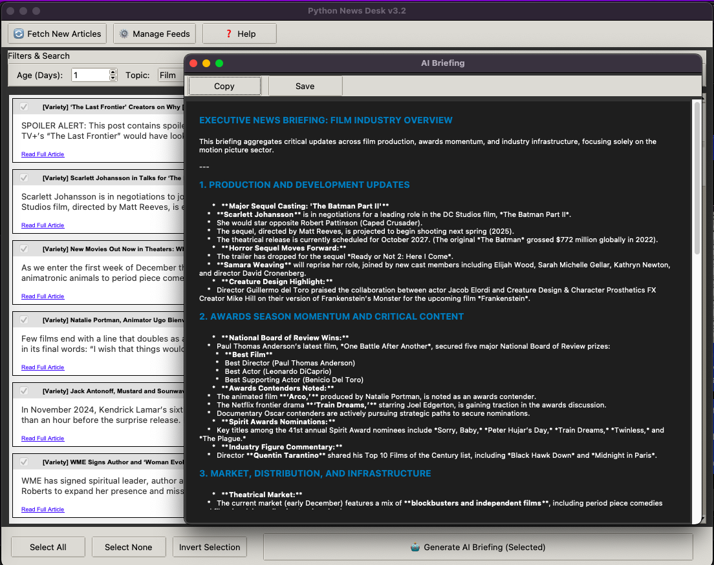
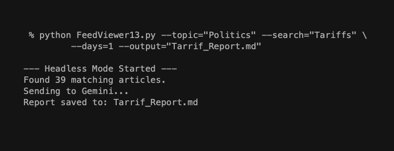

# News Desk

**Personal Intelligence Infrastructure for the Fediverse Era**

A local-first news aggregation and AI synthesis tool that transforms RSS feeds into automated intelligence briefings. Built for people who want control over their information diet without drowning in headlines.

## What This Does

News Desk fetches articles from your chosen RSS feeds, filters them by topic and timeframe, and uses AI to synthesize key insights across multiple sources. You get executive summaries with citations, not an endless stream of individual articles.

Think of it as your personal intelligence analyst: it reads everything, identifies patterns, and briefs you on what matters.

## Features

- **Multi-source aggregation**: Subscribe to any RSS/Atom feed
- **Smart filtering**: By topic, keyword, and time window (1-30 days)
- **AI synthesis**: Generate executive briefings that connect dots across sources
- **Dual interface**: GUI for exploration, CLI for automation
- **Local control**: Your sources, your data, your LLM
- **Markdown output**: Portable, grep-able, version-controllable reports
- **Zero lock-in**: Standard formats (RSS, JSON, Markdown)

## Screenshots





## Requirements

### System Requirements
- Python 3.8+
- Internet connection (for fetching feeds and AI API)
- 100MB+ disk space for article cache

### Python Dependencies
```bash
pip install tkinter feedparser google-generativeai requests
```

### API Keys
- **Google Gemini API key** (free tier: 15 requests/min, 1500/day)
  - Get yours at: https://aistudio.google.com/app/api-keys
  - Set environment variable: `export GEMINI_API_KEY="your-key-here"`

### Optional
- **Ollama** (for local LLM instead of Gemini)
- **Mastodon account** (for automated posting)

## Installation

```bash
# Clone the repository
git clone https://github.com/BuckRogers1965/News-Desk.git
cd News-Desk

# Install dependencies
pip install -r requirements.txt

# Set your API key
export GEMINI_API_KEY="your-gemini-api-key"

# Initialize with sample feeds
cp feeds.sample.json feeds.json

# Run the GUI
python NewsDesk.py
```

## Usage

### GUI Mode

Launch the application:
```bash
python NewsDesk.py
```

**Basic Workflow:**
1. Click "🔄 Fetch New Articles" to update feeds (auto-runs if data is >2 hours old)
2. Filter by **Age** (1-30 days), **Topic**, and **Search** keywords
3. Check boxes next to articles you want analyzed
4. Click "🤖 Generate AI Briefing (Selected)"
5. Review synthesis with citations, copy or save as markdown

**Feed Management:**
- Click "⚙️ Manage Feeds" to add/remove sources
- Each feed can have multiple topic tags (e.g., "Tech", "AI", "Startups")
- Topics appear in the dropdown filter automatically

**Selection Tools:**
- **Select All** / **Select None**: Bulk operations
- **Invert Selection**: Toggle all checkboxes
- **Mouse wheel scrolling**: Works anywhere in the article list

### Command Line Mode (Automation)

Generate reports without opening the GUI:

```bash
# Daily tech briefing
python NewsDesk.py --topic="Tech" --days=1 --output=tech_brief.md

# Weekly climate roundup
python NewsDesk.py --topic="Environment" --days=7 --output=weekly_climate.md

# Search for specific keywords
python NewsDesk.py --search="quantum computing" --days=3 --output=quantum_news.md

# Combine filters
python NewsDesk.py --topic="Business" --search="AI" --days=1 --output=ai_business.md
```

**Command Line Options:**
- `--topic TOPIC`: Filter by topic tag (from feeds.json)
- `--days N`: Show articles from last N days (1-30)
- `--search TERM`: Filter by keyword in title/description
- `--output FILE`: Generate AI briefing and save to file (headless mode)

**Exit codes:**
- `0`: Success
- `1`: No articles found matching filters

### Automation Examples

**Daily morning briefing (crontab):**
```bash
# Run every day at 7 AM
0 7 * * * cd /path/to/news-desk && python NewsDesk.py --topic="Tech" --days=1 --output=~/briefs/tech_$(date +\%Y\%m\%d).md
```

**Weekly digest on Mondays:**
```bash
# Run every Monday at 8 AM
0 8 * * 1 cd /path/to/news-desk && python NewsDesk.py --topic="Business" --days=7 --output=~/briefs/weekly_business.md
```

**Multiple topic tracking:**
```bash
#!/bin/bash
# morning_brief.sh
DATE=$(date +%Y-%m-%d)

python NewsDesk.py --topic="Tech" --days=1 --output=/tmp/tech_${DATE}.md
python NewsDesk.py --topic="Climate" --days=1 --output=/tmp/climate_${DATE}.md
python NewsDesk.py --topic="Politics" --days=1 --output=/tmp/politics_${DATE}.md

# Archive
mkdir -p ~/archive/briefs/${DATE}
cp /tmp/*_${DATE}.md ~/archive/briefs/${DATE}/
```

### Feed Configuration

Edit `feeds.json` to manage your sources:

```json
[
    {
        "name": "Hacker News",
        "url": "https://news.ycombinator.com/rss",
        "topics": ["Tech", "Programming", "Startups"],
        "date_added": "2023-10-27"
    },
    {
        "name": "The Verge",
        "url": "https://www.theverge.com/rss/index.xml",
        "topics": ["Tech", "Gadgets", "Culture"],
        "date_added": "2023-10-27"
    }
]
```

**Topic tags** can be anything. Common patterns:
- **By domain**: "Tech", "Politics", "Science", "Business"
- **By region**: "USA", "Global", "Asia", "Europe"
- **By perspective**: "Conservative", "Progressive", "Libertarian"
- **By format**: "Podcast", "Video", "Longform"

The tool auto-generates filter dropdowns from your tags.

## Scroll Speed Tuning

If scrolling feels too fast/slow, edit these lines in `NewsDesk.py`:

**Around line 250** (canvas scrolling):
```python
delta = -e.delta * 30  # Decrease for slower, increase for faster
```

**Around line 290** (card scrolling):
```python
delta = -e.delta * 30  # Keep same as canvas for consistency
```

Change `30` to `10` for slower scrolling, or `50` for faster.

---

## A New Category of Product

### Beyond Traditional RSS Readers

Traditional RSS readers (Feedly, NetNewsWire, Inoreader) are built around a **content management paradigm**:
- Store every article forever
- Track read/unread state
- Organize into folders and tags
- Present articles one at a time

This creates the "inbox problem": hundreds of unread items, guilt about falling behind, endless scrolling through headlines.

**News Desk uses a different paradigm: Intelligence Analysis**

### The Intelligence Workflow

This is how intelligence agencies process information:

1. **Collection**: Gather from multiple sources (SIGINT, HUMINT, OSINT)
2. **Filtering**: Apply selectors (region, topic, timeframe, keywords)
3. **Synthesis**: Analysts read across sources and write briefings
4. **Dissemination**: Reports go to decision-makers with source citations
5. **Repeat**: Fresh collection window daily, new analysis

News Desk implements this exact workflow:

1. **Collection**: Ingest from RSS feeds (your chosen sources)
2. **Filtering**: Apply selectors (topic tags, timeframe, search terms)
3. **Synthesis**: AI reads across sources and generates briefings
4. **Dissemination**: Markdown reports with clickable citations
5. **Repeat**: `--days=1` gives you fresh daily intelligence

### What This Replaces

**Instead of:**
- Subscribing to Morning Brew, Axios, The Information ($$$)
- Paying for Perplexity Pro, ChatGPT Plus for news summaries
- Hiring analysts to read trade publications
- Spending 2 hours/day scanning headlines

**You get:**
- Automated daily briefings from sources YOU control
- AI synthesis at near-zero cost (Gemini free tier)
- Full transparency: see which sources informed each insight
- Scriptable, schedulable, auditable intelligence pipeline

### The Local-First Advantage

**What commercial services take from you:**
- Your reading habits (tracked, sold, used for targeting)
- Your data (locked in their platform)
- Your sources (their algorithm decides what you see)
- Your schedule (you read when they publish)

**What you control with News Desk:**
- Your sources (full transparency in feeds.json)
- Your data (markdown files you own forever)
- Your LLM (swap Gemini for Claude, GPT, Llama, local models)
- Your schedule (cron runs when YOU decide)
- Your privacy (nothing leaves your machine except API calls)

### Integration with the Fediverse

The real power comes from **automated distribution**:

```bash
#!/bin/bash
# Post daily briefing to Mastodon

DATE=$(date +%Y-%m-%d)

# Generate briefing
python NewsDesk.py --topic="Tech" --days=1 --output=/tmp/tech_${DATE}.md

# Post to your instance
python mastodon_post.py /tmp/tech_${DATE}.md \
  --account=@tech_brief@your.instance \
  --visibility=public \
  --hashtags="#TechNews #AI #DailyBrief"
```

**Run this on cron and you've built:**
- A personal news brand (your briefing bot)
- A public good (others can follow your summaries)
- A distributed media network (Fediverse, not corporate platform)
- An auditable information pipeline (all sources cited)

### Comparison Matrix

| Feature | Traditional RSS | Newsletter Services | News Desk |
|---------|----------------|---------------------|------------------|
| Source control | ✅ You choose | ❌ They choose | ✅ You choose |
| Data ownership | ✅ Local | ❌ Their servers | ✅ Local |
| AI synthesis | ❌ No | ⚠️ Black box | ✅ Transparent |
| Automation | ❌ Manual reading | ❌ Their schedule | ✅ CLI + cron |
| Cost | Free | $10-50/mo | Free (or local LLM) |
| Privacy | ✅ Private | ❌ Tracked | ✅ Private |
| Customization | ⚠️ Limited | ❌ None | ✅ Full control |
| Distribution | ❌ No | ❌ Email only | ✅ Fediverse |

### Use Cases

**Personal Knowledge Management:**
- Generate daily briefings, save to Obsidian/Notion
- Build a searchable archive of synthesized intelligence
- Track developments in your field over months/years

**Competitive Intelligence:**
- Monitor competitor news, product launches, funding
- Track industry trends across 50+ trade publications
- Generate weekly executive summaries for your team

**Investment Research:**
- Follow sector-specific news (climate tech, fintech, biotech)
- Correlate developments across geographies
- Automate deal flow intelligence

**Policy & Advocacy:**
- Monitor legislation, regulatory changes, court decisions
- Track media narratives across left/right sources
- Generate briefings for coalition partners

**Academic Research:**
- Follow preprint servers, journal feeds, conference proceedings
- Track emerging topics in your field
- Generate literature review summaries

**Journalism:**
- Monitor breaking news across wire services
- Track story development across multiple outlets
- Generate source lists for investigative pieces

### The Bigger Picture

We're entering an era where:
- **Information is abundant** (millions of articles/day)
- **Attention is scarce** (you have 24 hours)
- **AI can read and synthesize** (better than humans at scale)
- **Decentralization is possible** (Fediverse, local-first tools)

News Desk represents a new category: **Personal Intelligence Infrastructure**

Not a product you subscribe to. Infrastructure you run yourself.

Like email servers used to be centralized (AOL, Hotmail), then we got Gmail, now some people run their own again (Protonmail, self-hosted).

Like social media used to be decentralized (blogs + RSS), then centralized (Facebook, Twitter), now decentralizing again (Mastodon, Bluesky).

**News consumption is following the same arc:**
1. Centralized (newspapers, TV news)
2. Decentralized (blogs, RSS readers)
3. Re-centralized (Google News, Apple News, algorithmic feeds)
4. **Decentralizing again** (local LLMs, Fediverse, tools like this)

You're not just building a news reader. You're building infrastructure for the next phase of information consumption: **local control, AI augmentation, decentralized distribution**.

That's the real innovation here.

---

## Architecture

### Components

- `NewsDesk.py`: Main application (GUI + CLI)
- `GetNews.py`: Feed fetching and parsing logic
- `feeds.json`: Your source configuration
- `entries.xml`: Article cache (auto-refreshes if >2 hours old)

### Data Flow

```
RSS Feeds → GetNews.py → entries.xml → NewsDesk.py → AI API → Markdown Report
                                              ↓
                                          feeds.json
                                          (topic tags)
```

### Why XML for Cache?

The `entries.xml` format allows incremental updates without re-fetching everything. New articles are appended, old ones age out naturally based on your `--days` filter.

### Extending the Tool

**Swap AI backends:**

Replace Gemini with Claude:
```python
import anthropic
client = anthropic.Anthropic(api_key=ANTHROPIC_API_KEY)
response = client.messages.create(
    model="claude-3-5-sonnet-20241022",
    max_tokens=2000,
    messages=[{"role": "user", "content": prompt}]
)
```

Replace with local Ollama:
```python
import ollama
response = ollama.generate(
    model='llama3.1:70b',
    prompt=prompt
)
```

**Add new source types:**

Edit `GetNews.py` to support:
- JSON feeds
- Atom feeds (already supported via feedparser)
- Web scraping (BeautifulSoup)
- API endpoints (Twitter, Reddit, etc.)

**Change output formats:**

Currently outputs Markdown. Easy to add:
- HTML (with styling)
- JSON (for further processing)
- Email (send via SMTP)
- Slack/Discord webhooks

## FAQ

**Q: Does this work offline?**
A: Partially. Once articles are cached in `entries.xml`, you can filter and browse without internet. But AI synthesis requires API access (unless you use local Ollama).

**Q: How much does Gemini cost?**
A: Free tier gives you 1500 requests/day. Each briefing = 1 request. More than enough for personal use.

**Q: Can I use this for commercial purposes?**
A: Check your AI provider's terms. Gemini free tier is for personal use only. For commercial, use Gemini Pro or another provider.

**Q: How do I backup my data?**
A: Just backup three files: `feeds.json` (your sources), `entries.xml` (cached articles), and your `~/briefs/` folder (generated reports). All plain text, easy to version control.

**Q: Does this violate RSS feed terms of service?**
A: You're fetching publicly available RSS feeds and generating personal summaries. This is the intended use of RSS. Don't republish full article text or hammer servers with requests.

**Q: Can multiple people use this as a shared service?**
A: The current version is single-user. But you could run it on a server and post briefings to a shared Mastodon account that others follow.

**Q: How do I handle duplicate articles?**
A: Currently no deduplication. If the same story appears in multiple feeds, it'll be included multiple times. The AI usually recognizes duplicates and synthesizes across them. Future enhancement: add hash-based deduplication.

**Q: What if a feed goes down?**
A: The tool continues with remaining feeds. Failed fetches are logged but don't crash the app. Check your `entries.xml` timestamp to see last successful update.

## Roadmap

- [ ] Deduplication of same story across sources
- [ ] Feed health monitoring (which feeds are broken/stale)
- [ ] Multiple AI backend support (easy swap between providers)
- [ ] Obsidian plugin for seamless integration
- [ ] Web UI option (for remote access)
- [ ] Mobile app (read briefings on phone)
- [ ] Collaborative filtering (share feed configs)

## Contributing

This is a personal tool open-sourced for others to adapt. Pull requests welcome for:
- Bug fixes
- New AI backend integrations
- Feed format support
- Documentation improvements

Please don't submit PRs that add heavy dependencies or change core workflow.

## License

MIT License - use it however you want.

## Credits

Inspired by the death of Google Reader (2013) and the rise of LLMs (2023). Built for people who want to stay informed without being consumed by information.

## Related Projects

- **Mastodon**: Decentralized social media (https://joinmastodon.org)
- **Ollama**: Local LLM runtime (https://ollama.ai)
- **Newsboat**: Terminal RSS reader (https://newsboat.org)
- **Miniflux**: Minimalist RSS reader (https://miniflux.app)

## Support

- Issues: https://github.com/BuckRogers1965/News-Desk/issues
- Discussions: https://github.com/BuckRogers1965/News-Desk/discussions
- Mastodon: @BuckRogers1965@techhub.social

---

**"Intelligence is not about reading everything. It's about reading the right things and connecting the dots."**
